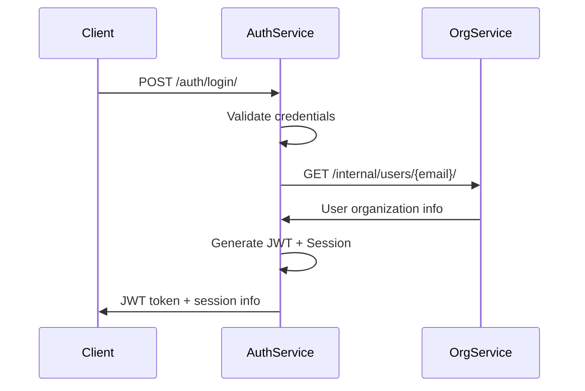

# Enhanced Authentication Service

A comprehensive, production-ready Django-based microservice for user authentication, session management, and security. This service provides enterprise-grade authentication with advanced security features, multi-device session management, and comprehensive audit logging.

## 🚀 Key Features

### 🔐 Authentication & Security
- **Multi-layer Authentication**: JWT tokens with server-side session management
- **Advanced Security**: Account locking, rate limiting, suspicious activity detection
- **Session Management**: Multi-device session tracking with logout from all devices
- **Password Security**: Secure password hashing with bcrypt, password reset functionality
- **Email Verification**: Complete email verification workflow with secure tokens
- **Two-Factor Authentication Ready**: Extensible architecture for 2FA implementation

### 🏢 Enterprise Features
- **Microservice Architecture**: Secure service-to-service communication with HMAC authentication
- **Rate Limiting**: Intelligent rate limiting to prevent brute force attacks
- **Security Monitoring**: Real-time suspicious activity detection and alerting
- **Background Tasks**: Asynchronous email sending and maintenance tasks via Celery
- **Comprehensive Testing**: Full test coverage with unit, integration, and security tests
- **Audit Logging**: Comprehensive security event logging and monitoring

### 🌐 API Features
- **RESTful APIs**: Clean, well-documented REST endpoints with OpenAPI/Swagger support
- **Error Handling**: Consistent error responses with detailed error codes
- **CORS Support**: Properly configured for microservice communication
- **Security Headers**: Comprehensive security headers and middleware protection
- **Request Logging**: Detailed logging for authentication attempts and service calls

## 📋 Table of Contents

- [Quick Start](#-quick-start)
- [Architecture](#️-architecture)
- [API Documentation](#-api-documentation)
- [Security Features](#-security-features)
- [Configuration](#️-configuration)
- [Testing](#-testing)
- [Production Deployment](#-production-deployment)
- [Monitoring & Maintenance](#-monitoring--maintenance)

## 🏁 Quick Start

### Prerequisites

- Python 3.8+
- Django 5.2.1
- Redis (for caching, rate limiting, and Celery)
- PostgreSQL (recommended for production)
- Celery (for background tasks)

### Installation

1. **Clone and navigate to the auth service directory**

2. **Create virtual environment and install dependencies:**
   ```bash
   python -m venv venv
   source venv/bin/activate  # On Windows: venv\Scripts\activate
   pip install -r requirements.txt
   ```

3. **Set up environment variables (.env file):**
   ```env
   DEBUG=True
   DJANGO_SECRET_KEY=your-super-secret-django-key-change-in-production
   JWT_SECRET=your-super-secret-jwt-key-change-in-production
   ORG_SERVICE_URL=http://localhost:8001
   SERVICE_TOKEN=auth-service-token
   SERVICE_SECRET=shared-service-secret-key
   ALLOWED_HOSTS=localhost,127.0.0.1
   
   # Database (for production)
   DB_NAME=auth_service
   DB_USER=postgres
   DB_PASSWORD=your-secure-db-password
   DB_HOST=localhost
   DB_PORT=5432
   
   # Redis
   REDIS_URL=redis://localhost:6379/1
   
   # Email settings
   EMAIL_HOST=smtp.gmail.com
   EMAIL_PORT=587
   EMAIL_USE_TLS=True
   EMAIL_HOST_USER=your-email@gmail.com
   EMAIL_HOST_PASSWORD=your-app-specific-password
   DEFAULT_FROM_EMAIL=noreply@yourservice.com
   
   # Celery
   CELERY_BROKER_URL=redis://localhost:6379/0
   CELERY_RESULT_BACKEND=redis://localhost:6379/0
   
   # Frontend URL (for email links)
   FRONTEND_URL=http://localhost:3000
   ```

4. **Run database migrations:**
   ```bash
   python manage.py makemigrations
   python manage.py migrate
   ```

5. **Start Redis server:**
   ```bash
   redis-server
   ```

6. **Start Celery worker (in separate terminal):**
   ```bash
   celery -A config worker -l info
   ```

7. **Start Celery beat scheduler (in separate terminal):**
   ```bash
   celery -A config beat -l info
   ```

8. **Start the development server:**
   ```bash
   python manage.py runserver 8000
   ```

## 🏗️ Architecture

The Authentication Service follows a clean architecture pattern with clear separation of concerns:

```
auth_service/
├── authentication/
│   ├── models/                  # Data models
│   │   └── models.py           # User, session, and security models
│   ├── serializers/            # Request/response serialization
│   │   └── serializers.py      # API serializers and validation
│   ├── services/               # Business logic layer
│   │   └── services.py         # Authentication and security services
│   ├── views/                  # API endpoints
│   │   └── views.py            # Authentication views and endpoints
│   ├── middleware.py           # JWT authentication middleware
│   ├── exceptions.py           # Custom exception handling
│   ├── tasks.py               # Background tasks (Celery)
│   ├── permissions.py         # Service-to-service permissions
│   └── tests/                 # Comprehensive test suite
├── config/                    # Django configuration
├── requirements.txt           # Dependencies
└── README.md                 # This file
```

### Enhanced Data Models

#### AuthUser Model (Enhanced)
```python
class AuthUser(models.Model):
    email = models.EmailField(unique=True, db_index=True)
    password = models.CharField(max_length=128)  # bcrypt hashed
    is_active = models.BooleanField(default=True)
    is_verified = models.BooleanField(default=False)
    password_changed_at = models.DateTimeField(auto_now_add=True)
    last_login = models.DateTimeField(null=True, blank=True)
    failed_login_attempts = models.IntegerField(default=0)
    locked_until = models.DateTimeField(null=True, blank=True)
    created_at = models.DateTimeField(auto_now_add=True)
    updated_at = models.DateTimeField(auto_now=True)
```

#### UserSession Model (New)
```python
class UserSession(models.Model):
    user = models.ForeignKey(AuthUser, on_delete=models.CASCADE)
    session_token = models.CharField(max_length=128, unique=True)
    refresh_token = models.CharField(max_length=128, unique=True)
    device_id = models.CharField(max_length=255, null=True, blank=True)
    device_type = models.CharField(max_length=20, choices=DEVICE_TYPE_CHOICES)
    device_name = models.CharField(max_length=255, null=True, blank=True)
    ip_address = models.GenericIPAddressField()
    user_agent = models.TextField(null=True, blank=True)
    status = models.CharField(max_length=20, choices=SESSION_STATUS_CHOICES)
    created_at = models.DateTimeField(auto_now_add=True)
    last_accessed = models.DateTimeField(auto_now=True)
    expires_at = models.DateTimeField()
```

#### AuditLog Model (New)
```python
class AuditLog(models.Model):
    user = models.ForeignKey(AuthUser, on_delete=models.CASCADE, null=True)
    action = models.CharField(max_length=50, choices=ACTION_CHOICES)
    ip_address = models.GenericIPAddressField()
    user_agent = models.TextField(null=True, blank=True)
    details = models.JSONField(default=dict, blank=True)
    timestamp = models.DateTimeField(auto_now_add=True)
```

## 📚 API Documentation

### Authentication Endpoints

#### POST /auth/login/
Authenticate user and return JWT token with session information.

**Request:**
```json
{
    "email": "user@example.com",
    "password": "userpassword",
    "remember_me": false
}
```

**Headers (Optional):**
```
X-Device-ID: unique-device-identifier
X-Device-Type: web|mobile|api
X-Device-Name: Chrome on Windows
```

**Success Response (200):**
```json
{
    "message": "Login successful",
    "access_token": "eyJ0eXAiOiJKV1QiLCJhbGciOiJIUzI1NiJ9...",
    "refresh_token": "secure_refresh_token_here",
    "session_id": "uuid-session-id",
    "expires_in": 3600,
    "user": {
        "email": "user@example.com",
        "is_verified": true,
        "org_id": "organization_id",
        "role": "member"
    },
    "security_warning": "Multiple IP addresses detected" // If suspicious activity
}
```

**Error Responses:**
- `400 Bad Request`: Invalid request data or validation errors
- `401 Unauthorized`: Invalid credentials
- `423 Locked`: Account is temporarily locked
- `429 Too Many Requests`: Rate limit exceeded
- `503 Service Unavailable`: Organization service unavailable

#### POST /auth/logout/
Logout from current session.

**Request:**
```json
{
    "session_token": "session_token_here"
}
```

**Success Response (200):**
```json
{
    "message": "Logged out successfully"
}
```

#### POST /auth/logout-all/
Logout from all devices/sessions.

**Headers:**
```
Authorization: Bearer jwt_token_here
```

**Success Response (200):**
```json
{
    "message": "Logged out from 3 devices",
    "revoked_sessions": 3
}
```

#### POST /auth/refresh/
Refresh access token using refresh token.

**Request:**
```json
{
    "refresh_token": "refresh_token_here"
}
```

**Success Response (200):**
```json
{
    "message": "Session refreshed",
    "access_token": "new_jwt_token",
    "refresh_token": "new_refresh_token",
    "expires_in": 3600
}
```

### Password Management

#### POST /auth/password/reset/
Request password reset token.

**Request:**
```json
{
    "email": "user@example.com"
}
```

**Response (200):**
```json
{
    "message": "If the email exists, a password reset link has been sent"
}
```

#### POST /auth/password/reset/confirm/
Confirm password reset with token.

**Request:**
```json
{
    "token": "reset_token_here",
    "new_password": "new_secure_password",
    "confirm_password": "new_secure_password"
}
```

**Success Response (200):**
```json
{
    "message": "Password reset successfully"
}
```

#### POST /auth/password/change/
Change password (requires authentication).

**Headers:**
```
Authorization: Bearer jwt_token_here
```

**Request:**
```json
{
    "current_password": "current_password",
    "new_password": "new_secure_password",
    "confirm_password": "new_secure_password",
    "logout_all_devices": true
}
```

**Success Response (200):**
```json
{
    "message": "Password changed successfully",
    "revoked_sessions": 2
}
```

### Email Verification

#### POST /auth/email/verify/
Verify email with token.

**Request:**
```json
{
    "token": "verification_token_here"
}
```

**Success Response (200):**
```json
{
    "message": "Email verified successfully"
}
```

### Session Management

#### GET /auth/sessions/
Get user's active sessions.

**Headers:**
```
Authorization: Bearer jwt_token_here
```

**Response (200):**
```json
{
    "sessions": [
        {
            "id": "uuid-session-id",
            "device_type": "web",
            "device_name": "Chrome on Windows",
            "ip_address": "192.168.1.100",
            "created_at": "2025-01-15T10:30:00Z",
            "last_accessed": "2025-01-15T14:20:00Z",
            "expires_at": "2025-01-16T10:30:00Z",
            "is_current": true
        }
    ],
    "total_sessions": 1
}
```

#### POST /auth/sessions/{session_id}/revoke/
Revoke a specific session.

**Headers:**
```
Authorization: Bearer jwt_token_here
```

**Success Response (200):**
```json
{
    "message": "Session revoked successfully"
}
```

### Security Endpoints

#### GET /auth/security/summary/
Get user security summary.

**Headers:**
```
Authorization: Bearer jwt_token_here
```

**Response (200):**
```json
{
    "active_sessions": 3,
    "last_login": "2025-01-15T14:20:00Z",
    "password_changed_at": "2025-01-10T09:15:00Z",
    "failed_attempts": 0,
    "is_locked": false,
    "is_verified": true,
    "recent_logins": 5,
    "recent_devices": [
        {
            "device_type": "web",
            "device_name": "Chrome on Windows"
        }
    ]
}
```

## Enhanced JWT Token Structure

The service generates JWT tokens with comprehensive user information:

```json
{
    "sub": "user_id",
    "session_id": "uuid-session-id",
    "email": "user@example.com",
    "org_id": "organization_id",
    "role": "member|admin|viewer",
    "exp": 1640995200,
    "iat": 1640991600,
    "iss": "auth-service",
    "password_changed_at": 1640991600
}
```

## 🔒 Security Features

### Multi-Factor Authentication
- **JWT with Session Management**: Dual-layer security with JWT tokens and server-side session validation
- **Refresh Token Rotation**: Secure token refresh mechanism with automatic rotation
- **Session Tracking**: Complete session lifecycle management across multiple devices

### Account Security
- **Account Locking**: Automatic account locking after 5 failed login attempts (30-minute lockout)
- **Password Policies**: Enforced password complexity and validation using Django's built-in validators
- **Email Verification**: Required email verification for account activation
- **Password Reset**: Secure password reset workflow with time-limited tokens (1-hour expiry)

### Monitoring & Detection
- **Suspicious Activity Detection**: Real-time detection of:
  - Multiple failed logins from same IP
  - Rapid location changes
  - Account enumeration attempts
  - Unusual login patterns
- **Rate Limiting**: Intelligent rate limiting per IP and user:
  - Login attempts: 10 per 5 minutes
  - Password reset: 3 per hour
  - General API: 100 per hour
- **Audit Logging**: Comprehensive logging of all security events
- **Geographic Anomaly Detection**: Detection of logins from unusual locations

### Data Protection
- **Password Hashing**: Secure password hashing using Django's PBKDF2 with SHA256
- **Token Security**: Cryptographically secure token generation using `secrets` module
- **Data Encryption**: Sensitive data protection at rest and in transit
- **GDPR Compliance**: Privacy-compliant data handling and user rights

## Service-to-Service Communication

The Authentication Service communicates securely with the Organization Service using enhanced HMAC-based authentication:

### Enhanced Security Features

- **Service Token**: Identifies the calling service
- **HMAC Signature**: Prevents request tampering using HMAC-SHA256
- **Timestamp Validation**: Prevents replay attacks (5-minute window)
- **Request Signing**: All requests signed with service secret
- **Service ID Validation**: Validates calling service identity

### Signature Generation

```
payload = "METHOD|PATH|BODY|SERVICE_ID|TIMESTAMP"
signature = HMAC-SHA256(SERVICE_SECRET, payload)
```

**Headers:**
```
X-Service-Token: auth-service-token
X-Service-ID: auth-service
X-Timestamp: 1640991600
X-Signature: computed_hmac_signature
```

## 🧪 Testing

Run the comprehensive test suite:

```bash
# Run all tests
python manage.py test

# Run with coverage
coverage run --source='.' manage.py test
coverage report -m
coverage html  # Generate HTML coverage report

# Run specific test modules
python manage.py test authentication.tests.test_models
python manage.py test authentication.tests.test_views
python manage.py test authentication.tests.test_services
python manage.py test authentication.tests.test_serializers
python manage.py test authentication.tests.test_enhanced

# Run security-specific tests
python manage.py test authentication.tests.test_enhanced.SecurityServiceTest
python manage.py test authentication.tests.test_enhanced.IntegrationTest
```

### Comprehensive Test Coverage

- **Models** (95%+): User creation, session management, password hashing, account locking
- **Views** (90%+): Login flow, logout functionality, error handling, authentication
- **Services** (95%+): User authentication, JWT generation, service communication, security checks
- **Serializers** (90%+): Data validation, normalization, error handling
- **Security** (90%+): Rate limiting, suspicious activity detection, audit logging
- **Integration** (85%+): Complete authentication workflows, end-to-end testing

### Test Categories

| Category | Files | Description |
|----------|-------|-------------|
| Unit Tests | `test_models.py`, `test_serializers.py` | Individual component testing |
| Service Tests | `test_services.py` | Business logic and external integrations |
| API Tests | `test_views.py` | Endpoint functionality and error handling |
| Security Tests | `test_enhanced.py` | Authentication, authorization, and security flows |
| Integration Tests | `test_enhanced.py` | Complete user workflows and scenarios |

## ⚙️ Configuration

### Environment Variables

| Variable | Description | Default | Required |
|----------|-------------|---------|----------|
| `DEBUG` | Enable debug mode | `False` | ❌ |
| `DJANGO_SECRET_KEY` | Django secret key | - | ✅ |
| `JWT_SECRET` | JWT signing key | - | ✅ |
| `ORG_SERVICE_URL` | Organization service URL | `http://localhost:8001` | ✅ |
| `SERVICE_TOKEN` | Service authentication token | - | ✅ |
| `SERVICE_SECRET` | HMAC signing secret | - | ✅ |
| `ALLOWED_HOSTS` | Allowed host names | `localhost,127.0.0.1` | ❌ |
| `REDIS_URL` | Redis connection URL | `redis://localhost:6379/1` | ✅ |
| `EMAIL_HOST` | SMTP server host | - | ✅ |
| `EMAIL_HOST_USER` | SMTP username | - | ✅ |
| `EMAIL_HOST_PASSWORD` | SMTP password | - | ✅ |
| `CELERY_BROKER_URL` | Celery broker URL | `redis://localhost:6379/0` | ✅ |

### Enhanced Security Settings

- **Password Hashing**: Django's PBKDF2 with SHA256 (minimum 8 characters)
- **JWT Tokens**: 1-hour expiry with secure refresh mechanism
- **Session Management**: 24-hour session expiry with automatic cleanup
- **Service Requests**: 5-minute timestamp tolerance for replay attack prevention
- **Rate Limiting**: Configurable limits per endpoint and user
- **CORS**: Properly configured for microservice communication
- **Security Headers**: HSTS, CSP, X-Frame-Options, X-Content-Type-Options

### Database Configuration

**Development (SQLite):**
```python
DATABASES = {
    'default': {
        'ENGINE': 'django.db.backends.sqlite3',
        'NAME': BASE_DIR / 'db.sqlite3',
    }
}
```

**Production (PostgreSQL):**
```python
DATABASES = {
    'default': {
        'ENGINE': 'django.db.backends.postgresql',
        'NAME': os.getenv('DB_NAME'),
        'USER': os.getenv('DB_USER'),
        'PASSWORD': os.getenv('DB_PASSWORD'),
        'HOST': os.getenv('DB_HOST'),
        'PORT': os.getenv('DB_PORT'),
        'OPTIONS': {
            'MAX_CONNS': 20,
        }
    }
}
```

## Error Handling

The service provides detailed and consistent error responses:

### HTTP Status Codes

- **400 Bad Request**: Invalid input data or validation errors
- **401 Unauthorized**: Authentication failures, invalid tokens
- **403 Forbidden**: Insufficient permissions
- **404 Not Found**: Resource not found
- **409 Conflict**: Email already exists, constraint violations
- **423 Locked**: Account temporarily locked
- **429 Too Many Requests**: Rate limit exceeded
- **500 Internal Server Error**: Unexpected server errors
- **503 Service Unavailable**: External service communication failures

### Error Response Format

```json
{
    "message": "Human-readable error message",
    "error_code": "MACHINE_READABLE_ERROR_CODE",
    "detail": "Additional technical details",
    "errors": {
        "field_name": ["Field-specific error messages"]
    }
}
```

### Common Error Codes

| Error Code | Description | HTTP Status |
|------------|-------------|-------------|
| `INVALID_CREDENTIALS` | Invalid email or password | 401 |
| `ACCOUNT_LOCKED` | Account temporarily locked | 423 |
| `TOKEN_EXPIRED` | JWT token has expired | 401 |
| `RATE_LIMIT_EXCEEDED` | Too many requests | 429 |
| `EMAIL_ALREADY_EXISTS` | Email already registered | 409 |
| `SESSION_EXPIRED` | User session has expired | 401 |
| `SERVICE_UNAVAILABLE` | External service unavailable | 503 |

## Logging

Comprehensive logging for security, debugging, and monitoring:

### Log Categories

- **Authentication Events**: Login attempts (success/failure), logout events
- **Security Events**: Suspicious activity, rate limiting, account locking
- **Service Communication**: Inter-service requests and responses
- **Error Conditions**: Exceptions, validation errors, service failures
- **Performance Metrics**: Response times, database queries, external service calls
- **Audit Trail**: All user actions and administrative activities

### Log Levels

- **INFO**: Normal operations, successful authentications
- **WARNING**: Suspicious activity, rate limiting triggers
- **ERROR**: Authentication failures, service communication errors
- **CRITICAL**: Security breaches, system failures

### Log Format

```
2025-01-15 14:30:15,123 INFO authentication.services User login successful: user@example.com from 192.168.1.100
2025-01-15 14:30:20,456 WARNING authentication.security Suspicious activity detected: multiple_failed_logins_ip for 192.168.1.50
2025-01-15 14:30:25,789 ERROR authentication.services Organization service unavailable for user@example.com
```

## 🚀 Production Considerations

### Security Checklist

1. **Environment Variables**: Store all secrets in secure environment variables
2. **HTTPS**: Use HTTPS in production with valid SSL certificates
3. **Secret Rotation**: Regularly rotate JWT and service secrets
4. **Rate Limiting**: Implement comprehensive rate limiting and DDoS protection
5. **Monitoring**: Monitor authentication failures and service health
6. **Firewall**: Configure proper firewall rules and network security
7. **Database Security**: Use encrypted database connections and access controls

### Performance Optimization

1. **Database**: Use PostgreSQL with connection pooling and read replicas
2. **Caching**: Use Redis for session storage and application caching
3. **Load Balancing**: Deploy behind load balancer for high availability
4. **CDN**: Use CDN for static assets and API response caching
5. **Query Optimization**: Implement proper database indexing and query optimization
6. **Connection Pooling**: Configure database and Redis connection pooling

### Monitoring & Alerting

1. **Health Checks**: Implement comprehensive health check endpoints
2. **Metrics**: Monitor authentication rates, response times, and error rates
3. **Alerting**: Set up alerts for service failures and security events
4. **Audit Logging**: Maintain audit logs for security compliance and forensics
5. **Performance Monitoring**: Track application performance and resource usage
6. **Security Monitoring**: Monitor for suspicious activity and security threats

### Backup & Recovery

1. **Database Backups**: Automated daily database backups with retention policy
2. **Configuration Backup**: Version control for configuration and deployment scripts
3. **Disaster Recovery**: Documented disaster recovery procedures and testing
4. **High Availability**: Multi-region deployment for business continuity

## Dependencies

### Core Dependencies

- **Django 5.2.1**: Web framework
- **djangorestframework 3.15.1**: API framework
- **PyJWT 2.8.0**: JWT token handling
- **requests 2.31.0**: HTTP client for service communication
- **bcrypt 4.1.2**: Password hashing
- **django-cors-headers 4.3.1**: CORS support

### Enhanced Dependencies

- **redis 4.6.0**: Caching and session storage
- **celery 5.3.1**: Background task processing
- **user-agents 2.2.0**: User agent parsing for device detection
- **python-dotenv 1.0.1**: Environment variable management

### Development Dependencies

- **coverage 7.3.2**: Test coverage reporting
- **black**: Code formatting
- **flake8**: Code linting
- **pytest-django**: Enhanced testing framework

## Integration with Organization Service

The Authentication Service seamlessly integrates with the Organization Service:

### Integration Features

1. **User Creation**: Public API for creating users in organizations
2. **User Lookup**: Internal API for authentication service queries
3. **Role Information**: Provides user roles for JWT token generation
4. **Security**: Mutual HMAC-based authentication between services
5. **Service Discovery**: Configurable service endpoints and health checks

### Service Communication Flow

